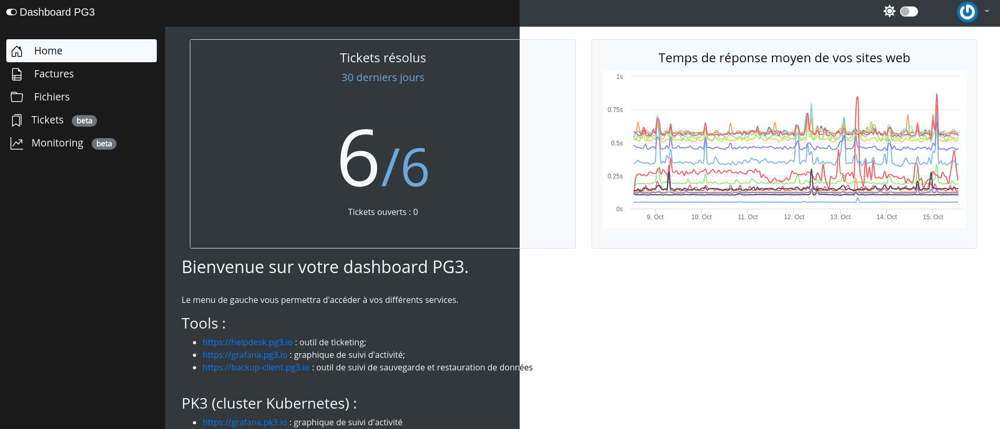

Dashboard
===
[](https://vuejs.org/)
[](https://twitter.com/pg3io/)
[](LICENCE)

# Introduction
Dashboard est un outil de listing de factures, basé sur le Headless CMS [Strapi](https://github.com/strapi/strapi).



# Fonctions

# Backend
* Liste d'entreprise
* Utilisteur par entreprise
* Liste des Factures par entreprise
* liste de fichiers
* Authentification avec un jwt
* AuthGuard de navigation


# FrontEnd
* Profile
* Profile Gravatar
* Mot de passe oublié
* Détails d'une facture
* Listing de factures par utilisateurs
    * Tri automatique par date
    * Chaque colonne du tableau de facture peut être trié par ordre alphabétique montant ou descendant
    * La colonne date peut-être trié du plus vieux au plus récent / du plus récent au plus vieux
    * Une colonne 'télécharger' pour récupérer sa facture
* Système de GED basique
* Listing des tickets
* Rendu des données du projet [crawlurl](https://github.com/pg3io/crawlurl) dans un graphique.


# Tests
* Des tests automatisés via [Cypress](https://cypress.io) sont disponibles dans le dossiers 'tests'.
  * la configuration => [ici (wiki)](https://github.com/pg3io/dashboard3/wiki/Tests-Automatis%C3%A9s)


# Prérequis
* Strapi avec:
  * le schéma => [ici (wiki)](https://github.com/pg3io/dashboard3/wiki/Strapi-sch%C3%A9ma)
  * la configuration => [ici (wiki)](https://github.com/pg3io/dashboard3/wiki/Strapi-configuration)
* Le module graphQL de Strapi


# Démarrage rapide
Déclarer l'url de votre API dans le Dockerfile => ``VUE_APP_API_URL``
```
docker-compose up
```
Ouvrer un nouveau terminal et lancer npm install
```
npm install
```
Puis
```
npm run serve
```
Rendez-vous ensuite sur le port renseigné => https://localhost:8080/


# Contributeurs

* [Vue.js](https://vuejs.org/)
* [Bootstrap](https://getbootstrap.com/)
* [Bootsrap-vue](https://bootstrap-vue.org/)
* [Bootstrap-icon](https://icons.getbootstrap.com/)
* [Strapi](https://github.com/strapi/strapi)
* [Graphql](https://graphql.org/)
* [Nodejs](https://nodejs.org/en/)
* [npm](https://www.npmjs.com/)
* [Cypress](https://cypress.io/)

# License
Ce projet est sous licence [Apache 2.0](https://www.apache.org/licenses/LICENSE-2.0) consulter le fichier [LICENSE](LICENSE) pour plus de détails.

# Informations sur l'auteur
Ce projet a été créé par [PG3](https://pg3.io) en decembre 2020 et maintenu par [PG3](https://pg3.io) en 2021.
